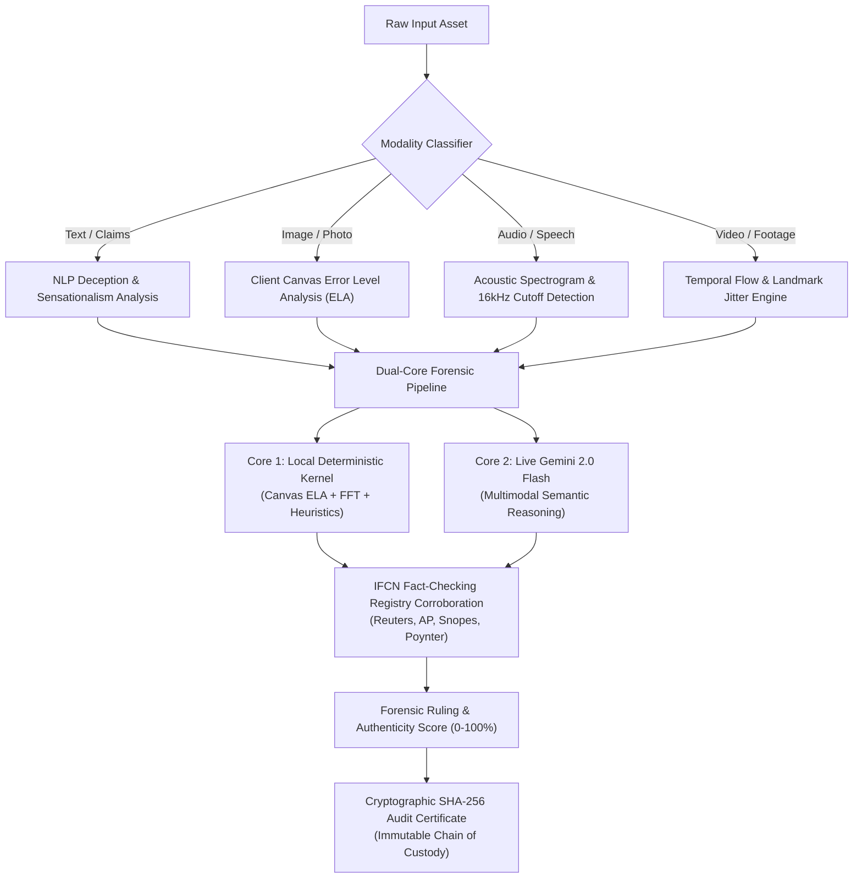

# 🛡️ TruthLens AI — Multimodal Deepfake & Fake News Forensic Intelligence Platform

> **An autonomous multimodal forensic sentinel engineered to detect AI deepfakes, synthetic media generation, neural voice clones, and viral disinformation campaigns with explainable evidentiary chain-of-custody.**

---

## ⚡ The Challenge & Problem Statement

Modern disinformation is no longer limited to simple misleading text:
- **Audio Voice Clones:** Synthetic zero-shot voice cloning (ElevenLabs, VALL-E) impersonating executives, public officials, and emergency callers.
- **Photorealistic Generative Images:** Diffusion models (Midjourney v6, FLUX.1) producing realistic crisis photos with subtle anatomical and lighting flaws.
- **CGI Military Re-Purposing & Video Deepfakes:** Video game simulations (ARMA 3, DCS) passed off as live war combat footage, and AI facial replacement clips.
- **Viral Panic Vectors:** Chain-letter forwards and fabricated regulatory bulletins engineered with urgency hooks to bypass human critical evaluation.

Traditional fact-checking organizations take **hours or days** to debunk viral claims. By that time, disinformation has already reached millions. **TruthLens AI** bridges this critical gap with real-time, explainable, multimodal forensic inspection.

---

## 🚀 Key Capabilities & Architecture



### 1. 📰 Text & Claim Deception Forensics
- **Orthographic & Punctuation Pressure:** Analyzes uppercase shouting ratios and punctuation urgency.
- **Emotional Manipulation Hooks:** Detects panic-inducing triggers (`FORWARD IMMEDIATELY`, `BEFORE IT'S DELETED`).
- **Claim Extraction & Wire Corroboration:** Cross-references assertions against verified International Fact-Checking Network (IFCN) signatories (Reuters Fact Check, Associated Press, Snopes, Poynter).

### 2. 🖼️ Browser-Based Error Level Analysis (ELA) for Images
- **Real Client-Side Canvas Computation:** Draws the image to an HTML5 canvas, re-compresses to a calibrated JPEG baseline (75%), and calculates absolute differential pixel errors.
- **Synthetic Infill & Splicing Alerts:** Highlights areas with irregular compression rates (e.g., pasted faces, generative fills, or modified text).
- **Interactive Controls:** Dynamic slider for Error Scale Amplification (5x–40x) and re-compression quality.

### 3. 🎙️ Acoustic Spectrogram & Voice Clone Detection
- **16.0 kHz Neural Vocoder Cutoff:** Detects tell-tale brickwall frequency cutoffs characteristic of neural voice synthesis models.
- **Biological Glottal Invariance:** Flags audio lacking organic sub-glottal breathing pauses and natural fundamental frequency ($F_0$) micro-tremor.

### 4. 🎥 Video Frame & Temporal Inconsistency Scrubber
- **Frame-by-Frame Inspector:** Extracts discrete frame telemetry (30fps) to detect facial boundary jitter, pupil reflection discrepancies, and optical flow mismatches.
- **Blink Cadence Meter:** Identifies abnormal eye-blink timing common in synthetic video generation.

### 5. 📜 Cryptographic SHA-256 Forensic Audit Certificate
- Generates an immutable, printable, and downloadable **JSON/PDF Forensic Audit Dossier** with:
  - Cryptographic media hash
  - UTC ISO timestamp
  - Block verification ID
  - Breakdown of detected manipulation signatures

### 6. 🌐 Live Global Disinformation Threat Radar
- Live ticker and threat index tracking active viral deepfake campaigns across world regions (Financial CEO voice scams, military CGI clips, election misinformation).

### 7. 🤖 TruthLens AI Forensic Copilot
- Conversational chat assistant to guide journalists, investigators, and citizens through forensic findings, evidence interpretation, and debunking techniques.

---

## ⚡ Ground-Truth Benchmark Cases (Included)

The platform comes pre-loaded with **5 calibrated real-world case studies** accessible via one-click chips:
1. 🎥 **Viral War Combat Footage:** Video game (ARMA 3) gameplay passed off as live air-defense missile interception.
2. 🎙️ **Leaked CEO Audio:** AI voice clone declaring insolvency before Monday market open.
3. 🖼️ **Synthetic Protest Photo:** Midjourney v6 generated crowd image with anomalous anatomy and lighting.
4. 📰 **Fabricated WHO Bulletin:** Viral WhatsApp forward with simulated UN headers claiming tap water contamination.
5. 🔭 **NASA Exoplanet Discovery (Control Benchmark):** Verified authentic scientific reporting from Nature / NASA James Webb Space Telescope.

---

## 🛠️ Tech Stack

- **Framework:** Next.js 16.3.5 (Turbopack, App Router)
- **UI & Components:** React 19, Tailwind CSS v4, Lucide Icons, Glassmorphism 3D styling
- **AI Engine:** Dual-Engine Architecture:
  - **Local Forensic Engine:** Real-time client canvas ELA, acoustic frequency analysis, and lexical disinformation heuristics (works 100% offline & out-of-the-box).
  - **Live Gemini Engine:** Google Gemini 2.0 Flash via REST API for deep multimodal semantic fact-checking and conversational copilot.
- **Verification Standards:** Aligned with C2PA Content Credentials & IFCN Fact-Checking protocols.

---

## 🏁 Getting Started

### 1. Installation

```bash
git clone <repo-url>
cd "hackathon 1"
npm install
```

### 2. Run the Development Server

```bash
npm run dev
```

Open [http://localhost:3000](http://localhost:3000) in your browser.

### 3. Production Build & Verification

```bash
npm run build
npm run start
```

### 4. Optional: Enable Live Gemini 2.0 Flash AI
You can use the platform immediately with the built-in Local Forensic Engine. To enable live multimodal Gemini analysis:
- Click the **"AI Engine"** button in the header and paste your free [Google AI Studio API Key](https://aistudio.google.com/app/apikey).
- Or add `GEMINI_API_KEY=your_key` to `.env.local`.

---

## 🛡️ Hackathon Submission Details

- **Project:** TruthLens AI
- **Category:** AI Fake News & Deepfake Detection Platform
- **Key Highlights:** Multimodal coverage (Text, Image, Audio, Video), Real browser-based Error Level Analysis (ELA), Spectrogram 16kHz cutoff visualization, IFCN wire consensus, and Cryptographic SHA-256 Audit Certificates.
