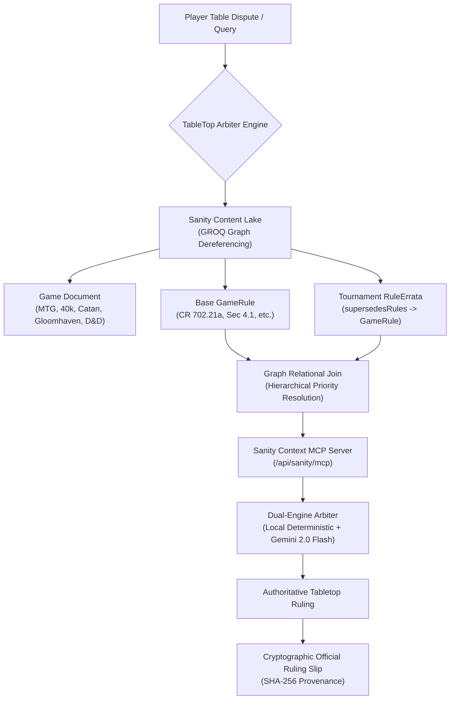

# ⚖️ TableTop Arbiter — Official Tournament Rules & Errata Grounded Copilot

> **An autonomous tabletop tournament rules arbiter powered by Sanity’s Structured Content Lake and Model Context Protocol (MCP). Eliminating LLM hallucinations on competitive board game and trading card game errata.**

[](https://dev.to/challenges/sanity-2026-09-16)
[](https://sanity.io)
[](https://nextjs.org)

---

## ⚡ The Challenge & Core Thesis

In competitive tabletop gaming (Magic: The Gathering, Warhammer 40k, Catan, Gloomhaven, Dungeons & Dragons), rules arguments stall tournaments and break game nights. When players consult traditional AI assistants (ChatGPT, Claude), **generic LLMs routinely hallucinate** because they rely on keyword similarity across thousands of conflicting online forums and outdated rulebooks.

### Why Vector RAG Fails vs Why Sanity Succeeds:
- **Vector RAG Blindness:** RAG splits text into arbitrary chunks. It cannot tell whether an old 2021 printed rule is officially superseded by a 2024 Balance Dataslate or a Head Judge FAQ update.
- **Sanity Structured Knowledge Lake:** Rules are represented as an interconnected graph. The `ruleErrata` schema contains a `supersedesRules[]` reference to the base `gameRule`.
- **Atomic GROQ Dereferencing:** A single GROQ query (`*[_type == "ruleErrata" && references($ruleId)]`) traverses the graph, guaranteeing that the AI agent prioritizes official tournament overrides.

---

## 🏗️ Architecture & Data Flow



---

## 🌟 Key Features

1. **⚔️ Dispute Benchmark Arena:** 5 pre-calibrated championship-level disputes showing side-by-side contrast between naive vector RAG hallucinations and grounded Sanity verdicts.
2. **🤖 Interactive Arbiter AI Copilot:** Natural-language chat evaluating custom table disputes with live GROQ grounding and step-by-step table remedy instructions.
3. **📜 Official Ruling Slip Modal:** Printable/copyable tournament judge sheet with SHA-256 verification hash to settle arguments at the table.
4. **🛰️ Production MCP Endpoint (`/api/sanity/mcp`):** Standards-compliant Model Context Protocol server exposing `resolve_tabletop_dispute`, `get_rule_errata_diff`, and `query_tournament_knowledge_lake`.
5. **🎛️ Sanity Studio Integration (`/studio`):** Full embedded Sanity Studio to manage games, base rules, errata patches, and benchmark dispute records.

---

## 🚀 Getting Started

### Prerequisites
- Node.js 18+ (tested on Node.js 20 & 22)
- npm or pnpm

### Installation & Run

```bash
# 1. Install dependencies
npm install

# 2. Run the development server
npm run dev

# 3. Open in browser:
# App: http://localhost:3000
# Sanity Studio: http://localhost:3000/studio
# MCP Server: http://localhost:3000/api/sanity/mcp
```

### Environment Variables (Optional)
The project runs 100% out of the box with built-in high-fidelity seed data. To connect your live Sanity project or Google Gemini key, create a `.env.local`:

```env
NEXT_PUBLIC_SANITY_PROJECT_ID=your_sanity_project_id
NEXT_PUBLIC_SANITY_DATASET=production
GEMINI_API_KEY=your_gemini_api_key
```

---

## ⚖️ License
MIT License. Built for the **DEV Community x Sanity Challenge 2026**.
